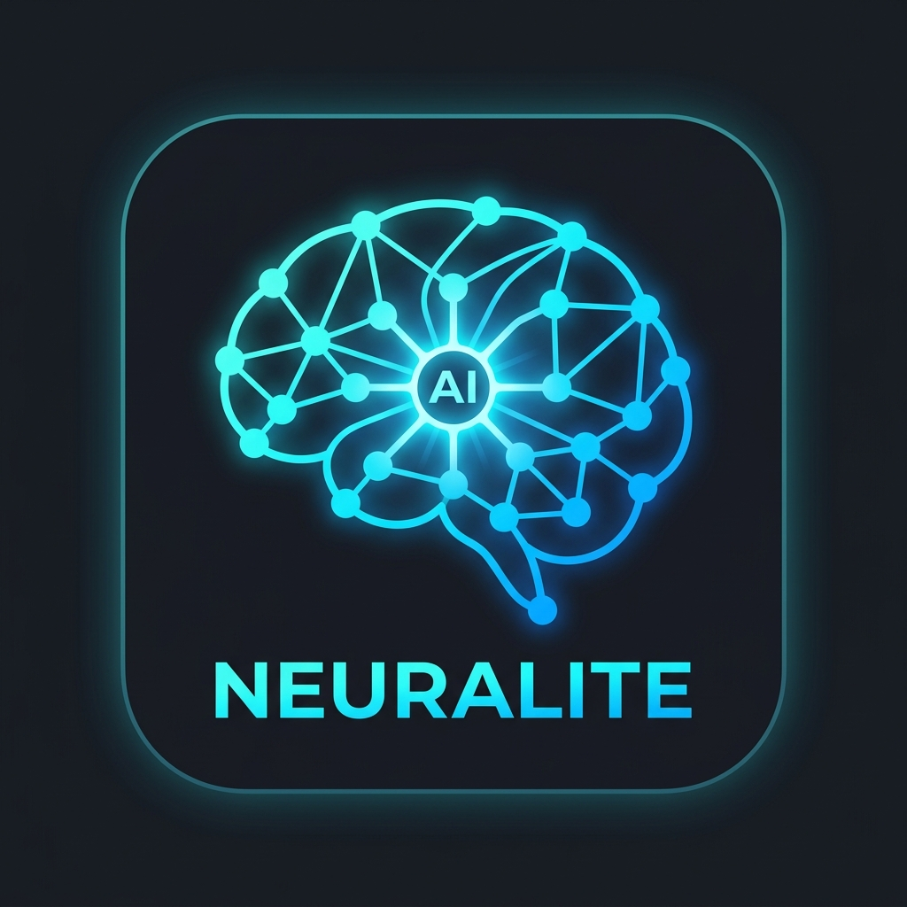
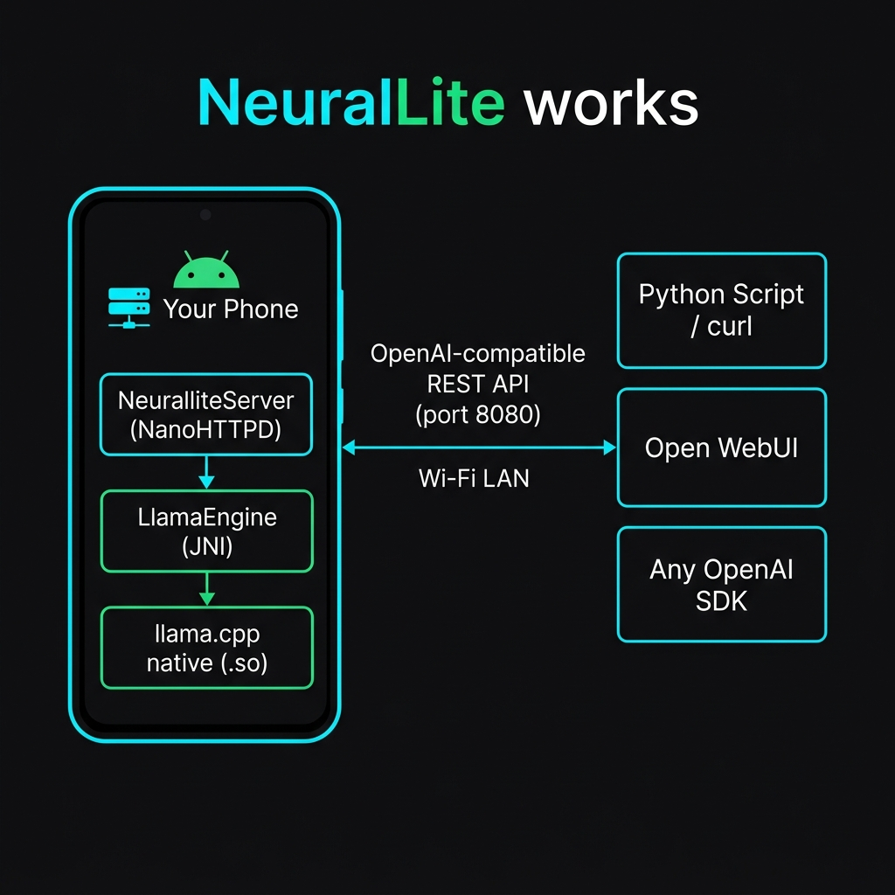
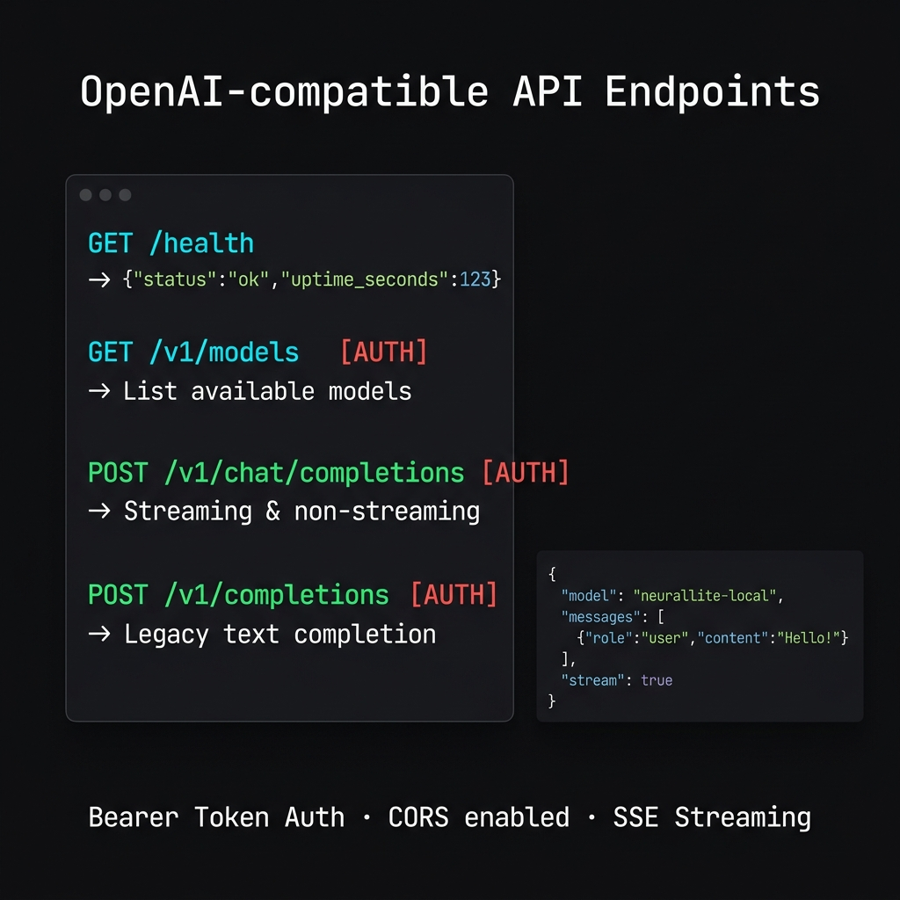
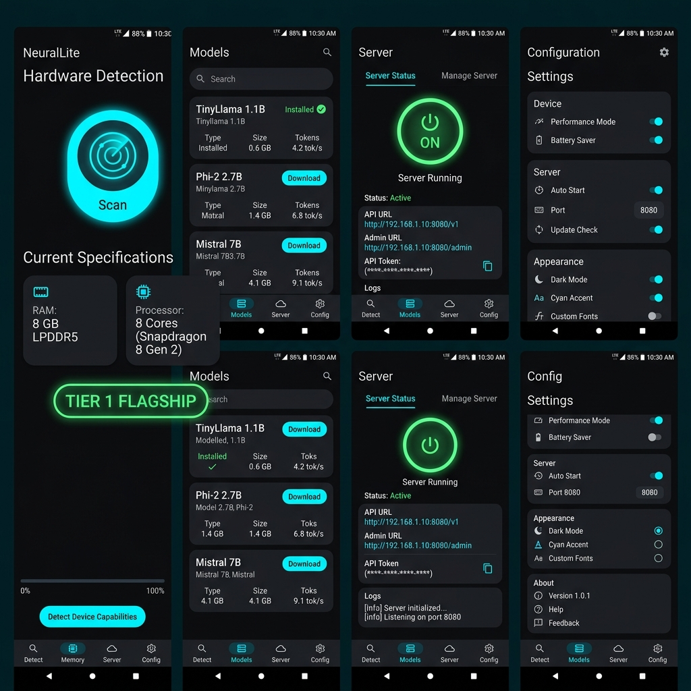

<div align="center">
  
  <h1>NeuralLite</h1>
  <p><strong>Turn your Android phone into a private, local AI server.</strong></p>
  <p>Run quantized LLMs on-device and expose an OpenAI-compatible REST API over Wi-Fi — no cloud, no fees, no data leaving your phone.</p>

  <br/>

  
  
  
  
</div>

---

## Table of Contents

- [What is NeuralLite?](#what-is-neurallite)
- [Key Features](#key-features)
- [Architecture](#architecture)
- [The Local AI Server](#-the-local-ai-server)
  - [How it works](#how-it-works)
  - [API Reference](#api-reference)
  - [Connecting from a PC / Script / Other App](#connecting-from-a-pc--script--other-app)
- [On-Device LLM Engine](#-on-device-llm-engine)
- [Hardware Detection & Tier System](#-hardware-detection--tier-system)
- [Model Catalog](#-model-catalog)
- [App Screens](#-app-screens)
- [Installation](#installation)
- [Security](#-security)
- [Requirements](#requirements)
- [Build from Source](#build-from-source)
- [Tech Stack](#tech-stack)

---

## What is NeuralLite?

NeuralLite is an Android app that hosts a full **HTTP inference server** directly on your phone. It runs quantized large language models (GGUF format via **llama.cpp**) entirely on-device and exposes them through an **OpenAI-compatible REST API** on your local Wi-Fi network.

This means any tool, script, or application that already speaks the OpenAI API protocol — from `curl` to Open WebUI to LangChain — can use your phone as its AI backend, **with zero cloud dependency**.

---

## Key Features

| Feature | Description |
|---|---|
| 📡 **Phone as AI Server** | Runs a full HTTP server on port `8080`, reachable from any device on your Wi-Fi LAN |
| 🤖 **OpenAI-Compatible API** | `/v1/chat/completions`, `/v1/completions`, `/v1/models` — drop-in compatible with standard SDKs |
| ⚡ **Streaming Responses (SSE)** | Real-time token streaming via Server-Sent Events, just like ChatGPT |
| 🧠 **llama.cpp Native Engine** | JNI-powered C++ inference through `libllama_android.so` — maximum performance |
| 🔒 **Auto-Generated Bearer Token** | Encrypted per-device API key stored with `EncryptedSharedPreferences` (AES-256) |
| 📶 **mDNS / Bonjour Discovery** | Automatically broadcasts as `_neurallite._tcp` so other LAN devices can discover it |
| 🔋 **Foreground Service + Wake/Wi-Fi Locks** | Server stays alive with screen off; no battery or Wi-Fi suspension |
| 🎯 **Hardware Tier Detection** | Scans RAM, CPU cores, and ABI — recommends the right model for your device |
| 📦 **Built-in Model Catalog** | One-tap download of TinyLlama, Phi-2, Gemma, Mistral-7B, Llama-3-8B from HuggingFace |
| 🌗 **Dark Neon UI (Jetpack Compose)** | Material 3 with cyan/green accents, animated pulse indicators, live request log |

---

## Architecture



NeuralLite's architecture has three layers:

```
┌─────────────────────────────────────────────────────────┐
│                     Android App                         │
│  ┌──────────────┐   ┌──────────────┐   ┌────────────┐  │
│  │ Jetpack      │   │ NeuralliteVM │   │ Hardware   │  │
│  │ Compose UI   │──▶│ (ViewModel)  │──▶│ Scanner    │  │
│  └──────────────┘   └──────┬───────┘   └────────────┘  │
│                            │                            │
│  ┌─────────────────────────▼──────────────────────────┐ │
│  │        NeuralliteServerService (Foreground)        │ │
│  │   Wi-Fi Lock · Wake Lock · mDNS · Notification    │ │
│  └─────────────────────────┬──────────────────────────┘ │
│                            │                            │
│  ┌─────────────────────────▼──────────────────────────┐ │
│  │        NeuralliteServer (NanoHTTPD on :8080)       │ │
│  │  GET /health · GET /v1/models · POST /v1/chat/...  │ │
│  └─────────────────────────┬──────────────────────────┘ │
│                            │                            │
│  ┌─────────────────────────▼──────────────────────────┐ │
│  │           LlamaEngine (Kotlin singleton)           │ │
│  │     loadModelSafe() · runInferenceSafe() (JNI)    │ │
│  └─────────────────────────┬──────────────────────────┘ │
│                            │                            │
│  ┌─────────────────────────▼──────────────────────────┐ │
│  │         libllama_android.so  (llama.cpp C++)       │ │
│  └────────────────────────────────────────────────────┘ │
└─────────────────────────────────────────────────────────┘
             │  HTTP over Wi-Fi LAN (:8080)
             ▼
  ┌────────────────────┐  ┌──────────────────┐  ┌────────┐
  │  Python / curl     │  │   Open WebUI     │  │  Any   │
  │  scripts           │  │   LangChain      │  │  SDK   │
  └────────────────────┘  └──────────────────┘  └────────┘
```

---

## 📡 The Local AI Server

### How it works

When you tap **Start** on the Server screen:

1. `NeuralliteServerService` starts as a **foreground service** — it stays alive even with the screen off.
2. A **Wi-Fi lock** (`WIFI_MODE_FULL_HIGH_PERF`) prevents the radio from sleeping.
3. A **partial wake lock** keeps the CPU awake for inference.
4. `NeuralliteServer` (built on [NanoHTTPD](https://github.com/NanoHttpd/nanohttpd)) binds to `0.0.0.0:8080`.
5. The service registers itself via **mDNS** (`_neurallite._tcp`) so LAN devices can discover it automatically.
6. A persistent **notification** appears with the server's IP and a "Stop Server" action button.

The server shuts down cleanly when you tap **Stop** or dismiss the notification action — all locks are released and mDNS is unregistered.

### API Reference



#### `GET /health` — Liveness probe *(no auth required)*

```bash
curl http://192.168.1.42:8080/health
```
```json
{
  "status": "ok",
  "model": "TinyLlama 1.1B · Q8_0 · ctx=2048",
  "uptime_seconds": 142
}
```

---

#### `GET /v1/models` — List models *(auth required)*

```bash
curl http://192.168.1.42:8080/v1/models \
  -H "Authorization: Bearer <your-token>"
```
```json
{
  "object": "list",
  "data": [
    {
      "id": "neurallite-local",
      "object": "model",
      "owned_by": "neurallite"
    }
  ]
}
```

---

#### `POST /v1/chat/completions` — Chat inference *(auth required)*

Supports both **streaming** (`"stream": true`) and **non-streaming** modes.

```bash
curl http://192.168.1.42:8080/v1/chat/completions \
  -H "Authorization: Bearer <your-token>" \
  -H "Content-Type: application/json" \
  -d '{
    "model": "neurallite-local",
    "messages": [
      {"role": "system", "content": "You are a helpful assistant."},
      {"role": "user",   "content": "What is the capital of France?"}
    ],
    "max_tokens": 256,
    "temperature": 0.7,
    "stream": false
  }'
```

**Response:**
```json
{
  "id": "chatcmpl-a3f1b2c4",
  "object": "chat.completion",
  "model": "neurallite-local",
  "choices": [{
    "index": 0,
    "message": { "role": "assistant", "content": "The capital of France is Paris." },
    "finish_reason": "stop"
  }]
}
```

**Streaming (`"stream": true`) — Server-Sent Events:**
```
data: {"id":"chatcmpl-a3f1b2c4","choices":[{"delta":{"content":"The"},...}]}
data: {"id":"chatcmpl-a3f1b2c4","choices":[{"delta":{"content":" capital"},...}]}
data: [DONE]
```

---

#### `POST /v1/completions` — Legacy text completion *(auth required)*

```bash
curl http://192.168.1.42:8080/v1/completions \
  -H "Authorization: Bearer <your-token>" \
  -H "Content-Type: application/json" \
  -d '{"prompt": "Once upon a time", "max_tokens": 128}'
```

---

### Connecting from a PC / Script / Other App

Because the API is **OpenAI-compatible**, you can point any existing OpenAI client at your phone with zero code changes — just change the `base_url` and `api_key`.

#### Python (openai SDK)

```python
from openai import OpenAI

client = OpenAI(
    base_url="http://192.168.1.42:8080/v1",
    api_key="paste-your-token-here"
)

response = client.chat.completions.create(
    model="neurallite-local",
    messages=[{"role": "user", "content": "Explain quantum entanglement simply."}],
    stream=True
)

for chunk in response:
    print(chunk.choices[0].delta.content or "", end="", flush=True)
```

#### Open WebUI

1. Install [Open WebUI](https://github.com/open-webui/open-webui) on your PC.
2. Go to **Settings → Connections → OpenAI API**.
3. Set **API URL** to `http://<phone-ip>:8080/v1`.
4. Set **API Key** to your NeuralLite token.
5. Select `neurallite-local` from the model dropdown.

#### LangChain

```python
from langchain_openai import ChatOpenAI

llm = ChatOpenAI(
    base_url="http://192.168.1.42:8080/v1",
    api_key="paste-your-token-here",
    model="neurallite-local"
)

print(llm.invoke("Write a haiku about Android."))
```

---

## 🧠 On-Device LLM Engine

`LlamaEngine` is a Kotlin singleton that wraps the native **llama.cpp** library via JNI (`libllama_android.so`).

```
loadModelSafe(modelPath, nThreads, nCtx)
    │
    ├─ Unloads any existing model first (AtomicLong handle)
    ├─ Calls JNI loadModel() → returns native handle
    └─ Fetches model metadata via getModelInfo()

runInferenceSafe(prompt, maxTokens, temperature, onToken)
    │
    ├─ Runs entirely on Dispatchers.IO (never blocks UI)
    ├─ onToken callback → each generated token streamed live
    └─ Full response returned as String when complete
```

Key design decisions:
- The native handle is stored in an `AtomicLong` — safe for concurrent access without locks.
- Thread count defaults to `availableProcessors() / 2` (capped at minimum 2) to avoid thermal throttling.
- Context window (`nCtx`) defaults to 2048 — configurable per model.
- Errors surface via a `StateFlow<LlamaError?>` so the UI reacts reactively.

---

## 🎯 Hardware Detection & Tier System

Before choosing a model, NeuralLite scans your device and assigns it a **performance tier**:

| Tier | Label | RAM | CPU Cores | Recommended Models |
|------|-------|-----|-----------|-------------------|
| 1 | 🟢 Flagship | ≥ 8 GB | ≥ 8 | Llama 3 8B, Mistral 7B |
| 2 | 🔵 Mid-range | ≥ 4 GB | ≥ 6 | Mistral 7B, Phi-2, Gemma 2B |
| 3 | 🟡 Entry | ≥ 3 GB | ≥ 4 | Phi-2, Gemma 2B, TinyLlama |
| 4 | 🔴 Minimal | < 3 GB | < 4 | TinyLlama 1.1B only |

The scan reads: **total RAM**, **available RAM**, **CPU core count**, **CPU ABI** (`arm64-v8a`, etc.), **free storage**, and **Android API level**. Results are cached in `SharedPreferences` so subsequent launches are instant.

The **Capability Bar** in the Detect screen visually shows exactly which models are reachable on your current hardware.

---

## 📦 Model Catalog

All models are downloaded from HuggingFace in **GGUF** format. Storage usage is tracked live with a progress bar.

| Model | Size | RAM | Tok/s (est.) | Tiers | Tags |
|-------|------|-----|-------------|-------|------|
| **TinyLlama 1.1B** Q8_0 | 1.1 GB | 1.5 GB | ~25 | 3, 4 | ultra-light, chat |
| **Phi-2 2.7B** Q4_K_M | 1.6 GB | 3.0 GB | ~12 | 2, 3 | chat, code, instruct |
| **Gemma 2B IT** Q4_K_S | 1.3 GB | 2.5 GB | ~15 | 2, 3 | instruct, chat |
| **Mistral 7B Instruct** Q3_K_M | 3.1 GB | 5.5 GB | ~6 | 1, 2 | instruct, chat, powerful |
| **Llama 3 8B Instruct** Q4_K_M | 4.9 GB | 7.0 GB | ~5 | 1 | instruct, chat, powerful |

Each model card shows:
- Download / Load / Delete actions
- Live download progress bar
- ⚠️ RAM warning if device RAM is insufficient
- ✅ "Recommended" badge if the model matches your tier

---

## 📱 App Screens



The app has **4 screens** accessible via the bottom navigation bar:

### 1. Detect — Hardware Scan
Tap the radar button to scan your device. Your hardware tier is displayed with a color-coded badge and a capability bar showing which models are accessible.

### 2. Models — Model Manager
Browse the model catalog, download models directly from HuggingFace, load/unload them into the inference engine, and monitor storage usage.

### 3. Server — API Control Panel
- **Start / Stop** the HTTP server with a single tap (animated pulse when running).
- View **Local** (`localhost:8080/v1`) and **LAN** (`192.168.x.x:8080/v1`) endpoint URLs (tap to copy).
- **View / Copy / Regenerate** the Bearer API token.
- **Live metrics**: total request count, average tokens per second.
- **Request log**: scrollable list of the last 50 API calls with status codes and latency.

### 4. Config — Settings
App-level configuration options.

---

## Installation

Download the latest APK directly and sideload it:

**[⬇ Download NeuralLite.apk](NeuralLite.apk)**

> **Note:** You will need to enable *"Install from unknown sources"* in your Android settings. Go to **Settings → Apps → Special app access → Install unknown apps** and allow your file manager or browser.

**Steps:**
1. Download `NeuralLite.apk` to your phone.
2. Open it with your file manager and tap **Install**.
3. Grant the requested permissions (storage, notifications).
4. Open the app → **Detect** tab → tap **Run Hardware Scan**.
5. Go to **Models** → download a model suited to your tier.
6. Go to **Server** → tap the power button to **Start**.
7. Copy the LAN URL and API token, then connect from any device on your Wi-Fi.

---

## 🔒 Security

| Concern | How NeuralLite handles it |
|---------|--------------------------|
| **API Authentication** | Every `/v1/...` route requires a `Authorization: Bearer <token>` header |
| **Token Generation** | UUID v4 token generated on first server start |
| **Token Storage** | Stored in `EncryptedSharedPreferences` with AES-256-GCM encryption |
| **Token Rotation** | Tap "Regenerate" in the Server screen to invalidate and replace |
| **CORS** | All responses include `Access-Control-Allow-Origin: *` for browser clients |
| **Network Scope** | Server binds to `0.0.0.0` — accessible on LAN only (no internet exposure) |

> ⚠️ **Do not run NeuralLite on public Wi-Fi networks.** The server is accessible to anyone on the same network who has the token.

---

## Requirements

- **Android 8.0** (API 26) or higher
- **ARM64** device (`arm64-v8a` ABI)
- **Wi-Fi** connection for LAN API access
- **Storage** space for GGUF models (1.1 GB – 5 GB per model)
- **RAM** ≥ 2 GB (more is better — see tier table above)

---

## Build from Source

```bash
# Clone the repository
git clone https://github.com/bitxwolf/NeuralLite.git
cd NeuralLite

# Open in Android Studio (Hedgehog or newer recommended)
# Or build via Gradle:
./gradlew assembleRelease
```

The native `libllama_android.so` is pre-compiled and included in the APK. If you need to recompile llama.cpp for Android, see the [llama.cpp Android build guide](https://github.com/ggerganov/llama.cpp/blob/master/docs/android.md).

---

## Tech Stack

| Layer | Technology |
|-------|-----------|
| UI | Jetpack Compose · Material 3 |
| Architecture | MVVM · StateFlow · Coroutines |
| HTTP Server | NanoHTTPD (embedded, zero-dependency) |
| Inference | llama.cpp via JNI (`libllama_android.so`) |
| Encryption | AndroidX Security · EncryptedSharedPreferences (AES-256) |
| Network Discovery | Android NSD (mDNS / DNS-SD) |
| Model Downloads | Android DownloadManager |
| Language | Kotlin 100% |

---

<div align="center">
  <p>Made with ❤️ by <a href="https://github.com/bitxwolf">bitxwolf</a></p>
  <p><em>Your phone. Your model. Your API.</em></p>
</div>
